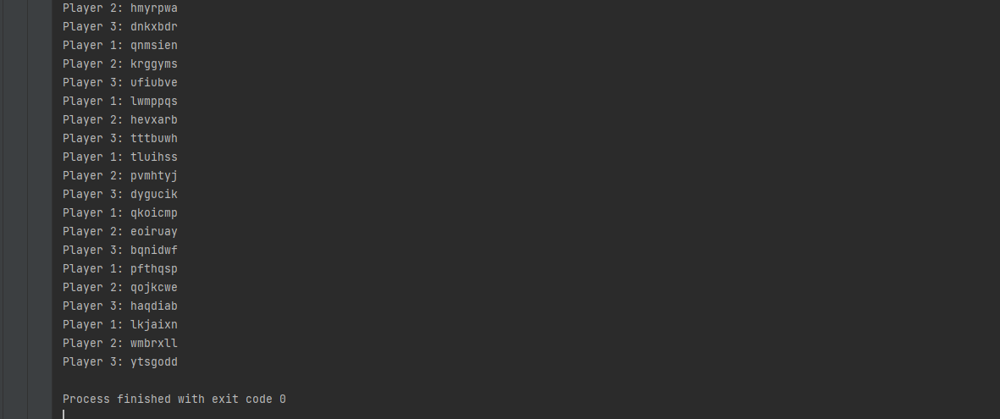

# Laboratory 7

## &#9745; Compulsory
* - [x] Create an object oriented model of the problem. You may assume that there are 10 tiles for each letter in the alphabet and each letter is worth a random number of points (between 1 and 10).
* - [x] Each player will have a name and they must perform in a concurrent manner, extracting repeatedly tokens from the board.
* - [x] After each extraction, the player will submit to the board all the letters.
* - [x] Simulate the game using a thread for each player.
      Pay attention to the synchronization of the threads when extracting tokens from the bag and when putting words on the board.

a part of the output...
